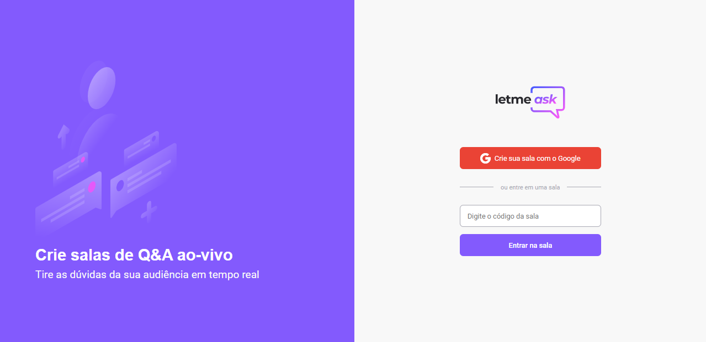

<h1 align="center">
  Let Me Ask
</h1>

<h1 align="center">
  https://letmeask-88cb8.web.app/
</h1>

<br></br>

<p align="center">
  <a href="#-technologies"><b>Technologies</b></a>&nbsp;&nbsp;&nbsp;|&nbsp;&nbsp;&nbsp;
  <a href="#-project"><b>Project</b></a>&nbsp;&nbsp;&nbsp;|&nbsp;&nbsp;&nbsp;
  <a href="#-layout"><b>Layout</b></a>&nbsp;&nbsp;&nbsp;
</p>

<br>

<h1 align="center">
  
</h1>


## 🚀 Getting started

Clone the project and access the folder.

```bash
$ git clone https://github.com/diaspd/let-me-ask.git
$ cd letmeask
```

Follow the steps below:
```bash
# Install the dependencies
$ npm i
$ npm i sass

# Start the project
$ npm start
```
The app will be available for access on your browser at http://localhost:3000
Remeber that you need an account on Firebase and a project to allow a realtime database. 

<br></br>

## 💻 Technologies

This project was developed with the following technologies:

<b>
  
- React
- Firebase
- TypeScript
  
</b>

<br></br>

## 📄 Project
💰 
In this project we made a project with features to create rooms, questions and answer them.

<br></br>

## 🔖 Layout

You can view the project layout through the links below:

[Layout Web](https://www.figma.com/file/u0BQK8rCf2KgzcukdRRCWh/Letmeask/duplicate) 

Remembering that you need to have a [Figma](http://figma.com/) account to access it.

<br></br>
Made with ♥ by Pedro Dias 👋 Me siga nas redes sociais! <br></br>


If you can give a little star, I appreciate it 🤩
